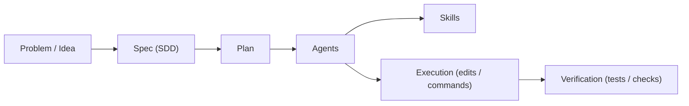

# 

	<strong>🧪 A small playground repo for learning GitHub Copilot in VS Code</strong> 
	<em>agents • skills • workflows • Spec‑Driven Development (SDD)</em>

	
	
	

## ✨ What this is

This repository is for experimenting with Copilot **hands-on**:

- 🧠 studying prompting + model/mode selection
- 🧾 writing specs before coding (SDD)
- 🤖 creating **project agents** for repeatable tasks
- 🧩 creating **agent skills** (optional / preview in VS Code)
- 🧰 capturing workflows and keeping docs in sync

## 🚀 Start here

- 📚 Docs index: [docs/README.md](docs/README.md)
- 🇬🇧 Copilot basics: [docs/COPILOT_BASICS_EN.md](docs/COPILOT_BASICS_EN.md)
- 🇨🇿 Základy Copilota: [docs/COPILOT_BASICS_CZ.md](docs/COPILOT_BASICS_CZ.md)
- 🤖 Agents overview: [docs/AGENTS.md](docs/AGENTS.md)
- 🧩 Skills overview: [docs/SKILLS.md](docs/SKILLS.md)

## 🗺️ How it fits together

## 🧱 Repo layout

- 📁 `docs/` — human-friendly documentation and indexes
- 🤖 `.github/agents/` — VS Code project agents (discoverable)
- 🧩 `.github/skills/` — VS Code agent skills (discoverable)
- 🧾 `tools/agentSkillsMap.json` — mapping used to keep agent/skill docs in sync
- 📚 `knowledge-base/` — knowledge base documents (assigned to agents via mapping; copied by installer)

## 🧭 Quick usage tips

- Open [docs/README.md](docs/README.md) first — it links to everything.
- If you add/change agents under `.github/agents/`, you may need **Developer: Reload Window** in VS Code.
- Skills are preview: enable `chat.useAgentSkills` if you want agents to use them.

## ✅ Verification

- Open [docs/README.md](docs/README.md) and confirm links work.
- In VS Code, confirm agents are discoverable from `.github/agents/`.
- If skills are enabled, confirm the list matches [docs/SKILLS.md](docs/SKILLS.md).

## 📦 Git-only agent installer (experimental)

This repo includes a Git-only installer for importing selected Copilot project agents (and required skills) into other repositories.

The installer also copies any required knowledge-base documents assigned to agents via the mapping. These are placed under `knowledge-base/` in the target repository.

> **Note:** The Git-only agent installer was created using the spec-writter agent and the git-only-agent-installer agent.

- Spec: [docs/specs/2026-01-17--git-only-agent-installer.md](docs/specs/2026-01-17--git-only-agent-installer.md)
- Usage: [tools/agent-installer/README.md](tools/agent-installer/README.md)

---

_Created by documentation writter agent_
