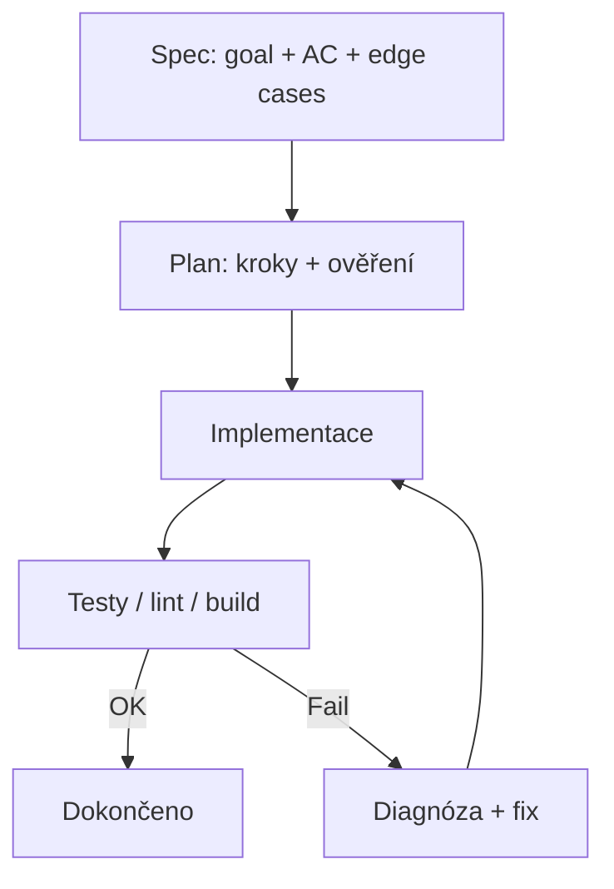
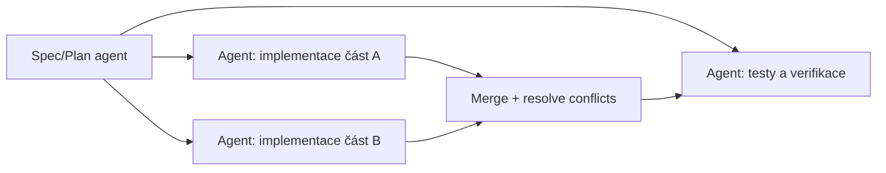
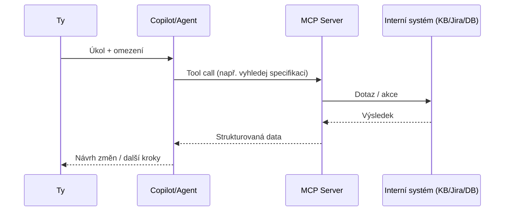

# Základy používání GitHub Copilot (VS Code)

> Cíl: rychle vysvětlit *jak Copilota používat efektivně* – od UI režimů přes volbu modelu až po Spec‑Driven Development, agenty, skills a MCP.

> 🧠 TL;DR
> - Vyber režim: **Chat** (návrhy) / **Inline** (doplňování) / **Edit** (hromadné změny) / **Agent** (vícekrokově) / **Plan** (kontrola postupu)
> - Vyber model: **mini** na rutinu ⚡, **max** na složitost 🧩
> - Používej **SDD/spec**: definuj „hotovo“ ✅, pak teprve implementuj

> 📚 Související dokumenty
> - Index dokumentace: [docs/README.md](README.md)
> - Agenti: [docs/AGENTS.md](AGENTS.md)
> - Skills: [docs/SKILLS.md](SKILLS.md)

## 📌 Obsah

- [1) Mentální model](#mental-model)
- [2) UI a režimy](#ui-modes)
- [3) Modely](#models)
- [4) Spec‑Driven Development (SDD)](#sdd)
- [5) Agenti](#agents)
- [6) Skills](#skills)
- [7) Workflow pro více agentů](#multi-agent-workflow)
- [8) MCP servery](#mcp)
- [9) SDD detail: greenfield vs brownfield](#sdd-greenfield-brownfield)
- [10) Praktické tipy a anti‑patterns](#tips)
- [11) Bezpečnost a soukromí](#security)
- [Šablony promptů](#prompt-templates)

<a id="mental-model"></a>
## 1) 🧠 Mentální model: „Copilot je spolupracovník“

- **Chat**: diskuse, návrhy architektury, vysvětlení kódu, generování návrhů a kroků.
- **Inline (v editoru)**: doplňování kódu přímo v souboru (autocomplete/inline suggestions) a „edit“ operace.
- **Agentní práce**: Copilot provádí více kroků (čtení, editace, běh příkazů, testy) a iteruje.

Prakticky: vybíráš režim podle toho, jestli potřebuješ *textový návrh*, *rychlou editaci*, nebo *komplexní zásah do projektu*.

<a id="ui-modes"></a>
## 2) 🧭 UI a režimy (Chat / Inline / Edit / Agent / Plan)

### Chat
Použij, když:
- chceš **návrh řešení** (architektura, přístup, rizika),
- potřebuješ **vysvětlit cizí kód**,
- chceš **porovnat varianty**.

💡 Tip: ptej se na *konkrétní výstup* („navrhni API“, „napiš acceptance criteria“, „zkrat to na 6 bodů“).

### Inline (autocomplete + inline chat)
Použij, když:
- doplňuješ funkce, testy, malé refaktory,
- potřebuješ rychle „dopsat zbytek“ podle kontextu souboru.

💡 Tip: nejvíc pomáhá, když je kolem kódu **jasný pattern** (typy, názvy, existující utilitky).

### Edit mód
Použij, když:
- chceš změny ve více místech se zachováním stylu (např. přejmenování, přidání parametru, úprava error handlingu),
- chceš „udělej X, ale bez rozbití API“.

### Plan mód (plánování)
Použij, když:
- úloha má více kroků a chceš **kontrolu nad postupem**,
- potřebuješ sladit očekávání (co se udělá, co se neudělá).

Dobrý plán je krátký, ověřitelný a má checkpointy (např. „přidat endpoint“, „přidat testy“, „ověřit build“).

### Agent mód
Použij, když:
- je potřeba **procházet projekt**, upravovat více souborů a dělat iterace,
- je potřeba **spouštět příkazy** (lint, testy, build) a opravovat chyby.

⚠️ Důležité: agent není kouzelník – potřebuje jasný cíl, omezení a definici „hotovo“.

<a id="models"></a>
## 3) 🧩 Modely: jak vybírat správně (a proč na tom záleží)

Model volíš podle kompromisu:
- **kvalita uvažování / spolehlivost** vs.
- **rychlost a cena** vs.
- **kapacita kontextu** (kolik toho „unese“ najednou).

### Praktická pravidla
- **„Max/Pro“ (větší model)**: architektura, složité refaktory, debugging, SDD/specifikace, návrhy API. 
- **„Mini“ (menší model)**: rychlé úpravy, boilerplate, jednoduché transformace, formátování, drobné testy.
- **Když je hodně kontextu** (velké diffs, více souborů): preferuj větší model nebo rozděl práci na menší kroky.

### Efektivní workflow s modely
1. **Mini**: vygeneruje šablonu / hrubý draft / nudné části.
2. **Max**: zkontroluje logiku, rohy, bezpečnost, integraci do projektu.
3. **Mini**: udělá mechanické úpravy (rename, doplnění testů, kosmetika).

💡 Tip: nejlepší výsledky jsou při *krátkých, přesných požadavcích* a *iteracích* („udělej to, pak spusti testy, pak oprav“).

<a id="sdd"></a>
## 4) 🧾 Spec‑Driven Development (SDD): co to je a proč to pomáhá

**SDD** je styl vývoje, kde před implementací vytvoříš **specifikaci** (co je cílem, rozsah, akceptační kritéria, edge cases), a teprve potom implementuješ.

Výhody:
- méně nedorozumění („co přesně znamená hotovo“),
- menší riziko scope creep,
- snazší delegování na agenty.

### Minimální dobrá specifikace
- **Goal**: co přesně dodáváme
- **Non‑goals**: co vědomě neděláme
- **Inputs/Outputs**: API, formáty, kontrakty
- **Acceptance criteria**: ověřitelné body
- **Edge cases & errors**: co se stane při chybách
- **Test strategy**: co otestovat a jak

### SpecKit a vlastní specs
- **SpecKit** je typicky sada šablon/pravidel, jak psát specy konzistentně.
- Bez SpecKitu: i jednoduché `SPEC.md` / `docs/specs/...` funguje skvěle.

Plan mód je ideální na to, aby Copilot:
- z návrhu udělal spec,
- navrhl rizika,
- přidal akceptační kritéria a testy.

### SDD smyčka


<a id="agents"></a>
## 5) 🤖 Agenti: co jsou a jaké typy dávají smysl

Agent je režim, kdy Copilot **vykonává sekvenci kroků**: prochází repozitář, mění soubory, spouští příkazy, čte výstupy a iteruje.

### Background vs cloud vs „codex“ agent (konceptuálně)
Konkrétní názvy se mohou lišit podle verze nástrojů, ale typicky:
- **Background agent**: běží déle, řeší vícekrokový úkol; ty mezitím děláš něco jiného.
- **Cloud agent**: část práce probíhá na vzdálené infrastruktuře (škálování, izolace, konzistence prostředí).
- **Codex agent** (často se tím myslí „coding agent“): agent zaměřený na kódové změny + spouštění build/test.

Pozn.: co přesně je dostupné (licence/enterprise) záleží na konfiguraci organizace.

### Jak vytvořit vlastního agenta tak, aby byl vidět v UI (VS Code)

VS Code umí „project agents“ načíst z repozitáře, ale musí být v přesné struktuře:

```text
.github/
  agents/
    muj-agent.agent.md
  skills/
    muj-skill/
      SKILL.md
docs/
  COPILOT_BASICS_EN.md
  COPILOT_BASICS_CZ.md
  AGENTS.md
  SKILLS.md
```

1) Vytvoř soubor `.github/agents/muj-agent.agent.md`

Minimální šablona:

```chatagent
---
name: 'Můj agent'
description: 'Krátký popis (k čemu slouží).'
model: GPT-5.2
---

Sem patří instrukce: cíle, co dělat/nedělat, workflow, testy, styl.
```

Poznámky:
- `model:` je volitelné. Pokud chceš, aby agent vždy použil model vybraný v Copilot UI, řádek `model:` vynech.
- Po přidání/úpravě agenta často pomůže **Developer: Reload Window**.
- V chatu pak agenta vybereš v headeru (Agent/Persona picker).

### Repo instrukce vs. agent (důležité rozlišení)

- **Project agent** = soubor v `.github/agents/*.agent.md` (volíš v UI).
- **Repo instrukce** = obecná pravidla pro práci v repu (často `copilot-instructions.md` apod.). Ta mohou být užitečná, ale nejsou to „UI-pickable“ agenti.

<a id="skills"></a>
## 6) 🛠️ Skills: co to je a kdy to použít

**Skill** je znovupoužitelná schopnost / postup, který Copilot umí aplikovat opakovaně (např. „vygeneruj testy“, „udělej migraci“, „připrav release notes“).

Na co se hodí:
- standardizované úlohy v týmu (šablony, formáty, opakované kroky),
- rychlé přepínání „jak pracovat“ (např. TDD skill vs. refactor skill).

### Jak vytvořit skill tak, aby ho VS Code našel

Project skills se dávají do `.github/skills/<skill-name>/SKILL.md`.

Minimální šablona `SKILL.md`:

```markdown
---
name: muj-skill
description: Stručně co skill dělá.
---

## Instructions
- Kdy skill použít
- Jaký má být výstup
- Jak ověřit, že je hotovo
```

Poznámky:
- Skills jsou ve VS Code (zatím) často **preview** feature.
- Obvykle je potřeba zapnout nastavení `chat.useAgentSkills`.
- Skill se uplatní hlavně v Agent módu (agent může použít skill jako „checklist / playbook“).

<a id="multi-agent-workflow"></a>
## 7) 🔁 Workflow pro více agentů (handoff + paralelizace)

Cíl: rozdělit práci tak, aby agenti nelezli do stejného místa současně.

### Osvědčený postup
- **Agent A (Spec/Plan)**: připraví spec + plán + rizika.
- **Agent B (Implement)**: implementuje podle spec.
- **Agent C (QA/Verification)**: spustí testy, projde logy, navrhne opravy.

Paralelně se dá dělat:
- analýza kódu vs. psaní dokumentace,
- implementace nezávislých modulů,
- příprava testů k různým částem.

### Mermaid: orchestrace


Tip: definuj „hranice“: soubory/foldery, které má konkrétní agent měnit.

<a id="mcp"></a>
## 8) 🔌 MCP servery: co to je a k čemu slouží

**MCP (Model Context Protocol)** je způsob, jak dát modelu/agentovi **standardizovaný přístup k nástrojům a datům** mimo samotný chat (např. interní služby, databáze, ticketing, repozitáře, znalostní báze).

Co to přináší:
- místo „kopíruj sem data“ má agent **konektor** (server), který data poskytne,
- jednotné rozhraní pro různé nástroje,
- lepší automatizaci (agent může volat tooly bezpečně a opakovaně).

Typické use-cases:
- čtení interní dokumentace/KB, vyhledávání v issue trackeru,
- generování reportů z CI, kontrola nasazení,
- doménové nástroje (např. „najdi zákazníka“, „ověř konfiguraci“).

### Mermaid: Copilot ↔ MCP


Bezpečnostní poznámka: MCP server je typicky místo, kde se řeší **autorizace, audit a limity**.

<a id="sdd-greenfield-brownfield"></a>
## 9) 🌱🏭 SDD detail: greenfield vs brownfield

### Greenfield (nový projekt)
Co agent potřebuje:
- jasný **produktový cíl** + scope,
- volby stacku (nebo explicitně „vyber a zdůvodni“),
- minimální standardy (lint/test/build),
- skeleton repa (struktura, conventions).

Doporučení:
- začni specem + „walking skeleton“ (nejtenčí end‑to‑end funkce),
- rychle přidej CI a základní testy.

### Brownfield (existující projekt)
Co agent potřebuje:
- mapu architektury (kde je co),
- existující konvence a „do not break“ pravidla,
- jak se spouští testy/build, jaké jsou prostředí.

Doporučení:
- nejdřív **čtení a porozumění** (agent má projít klíčové moduly),
- malé, bezpečné kroky + průběžné testy,
- explicitně hlídat kompatibilitu a migrace.

<a id="tips"></a>
## 10) ✅ Praktické tipy a anti‑patterns

- Dávej Copilotovi **definici hotovo** (AC), jinak bude „dokončovat“ donekonečna.
- Když se točí v kruhu, zmenši problém: „udělej jen A“, pak „udělej jen B“.
- Nech agenta spouštět **testy/lint** – textové ujištění nestačí.
- U citlivých částí (auth, platby, security) vyžaduj:
  - explicitní threat/edge review,
  - logiku ověření a testy.

<a id="security"></a>
## 11) 🔒 Bezpečnost, soukromí a „co neposílat“

- **Tajemství nikdy**: API klíče, tokeny, privátní klíče, hesla. Pokud už jsou v logu/souboru, nejdřív je zneplatni a odstraň.
- **PII a interní data**: neposílej celé výpisy DB nebo zákaznická data; radši anonymizuj a zmenši na minimální reprodukci problému.
- **Kontext je „input“**: do chatu se nepočítá jen prompt, ale i přiložené soubory a výstupy příkazů.
- **Výstup vždy review**: Copilot zrychluje práci, ale odpovědnost za změny neseš ty (zvlášť u auth, šifrování, compliance).
- **Licenční/zdrojové riziko**: u generovaného kódu drž stejné standardy jako u člověka – code review, testy, a když si nejsi jistý původem/patternem, napiš to radši vlastními slovy.

---

<a id="prompt-templates"></a>
## 🧷 Rychlé „šablony promptů“

- **Spec**: „Napiš krátkou specifikaci: goal, non-goals, AC (5 bodů), edge cases, test plan.“
- **Plan**: „Navrhni plán v 5–7 krocích s ověřením po každém kroku.“
- **Agent**: „Uprav projekt tak, aby X. Omezení: Y. Hotovo když: Z. Po změnách spusť testy.“
- **Model volba**: „Udělej draft na mini, pak zkontroluj max modelem a vypiš rizika.“
