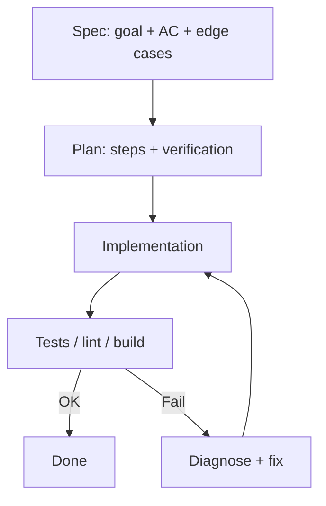
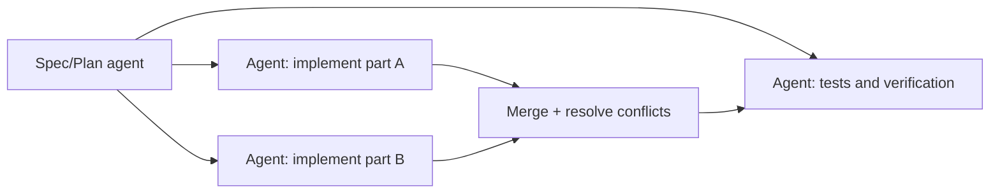
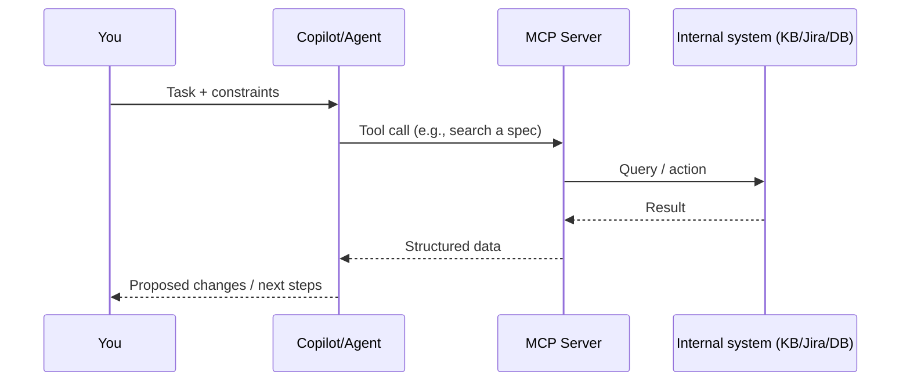

# GitHub Copilot basics (VS Code)

> Goal: quickly explain *how to use Copilot effectively* — from UI modes and model choice to Spec‑Driven Development, agents, skills, and MCP.

> 🧠 TL;DR
> - Pick a mode: **Chat** (ideas) / **Inline** (completion) / **Edit** (bulk edits) / **Agent** (multi-step execution) / **Plan** (structured planning)
> - Pick a model: **mini** for routine work ⚡, **max** for complex work 🧩
> - Use **SDD/specs**: define “done” ✅, then implement

> 📚 Related docs
> - Docs index: [docs/README.md](README.md)
> - Agents: [docs/AGENTS.md](AGENTS.md)
> - Skills: [docs/SKILLS.md](SKILLS.md)

## 📌 Contents

- [1) Mental model](#mental-model)
- [2) UI & modes](#ui-modes)
- [3) Models](#models)
- [4) Spec‑Driven Development (SDD)](#sdd)
- [5) Agents](#agents)
- [6) Skills](#skills)
- [7) Multi-agent workflow](#multi-agent-workflow)
- [8) MCP servers](#mcp)
- [9) SDD detail: greenfield vs brownfield](#sdd-greenfield-brownfield)
- [10) Practical tips & anti‑patterns](#tips)
- [11) Security & privacy](#security)
- [Prompt templates](#prompt-templates)

<a id="mental-model"></a>
## 1) 🧠 Mental model: “Copilot is a teammate”

- **Chat**: discussion, architecture options, explaining code, proposing steps.
- **Inline (in editor)**: autocomplete / inline suggestions and small local edits.
- **Agent work**: multi-step tasks — reads repo, edits files, runs commands, iterates.

In practice: pick the mode based on whether you need a *text proposal*, a *quick edit*, or a *multi-file change with verification*.

<a id="ui-modes"></a>
## 2) 🧭 UI & modes (Chat / Inline / Edit / Agent / Plan)

### Chat
Use when:
- you want a **solution approach** (architecture, tradeoffs, risks),
- you need **explanations** of unfamiliar code,
- you want **comparisons** of options.

Tip: ask for specific outputs (“propose an API”, “write acceptance criteria”, “compress to 6 bullets”).

### Inline (autocomplete + inline chat)
Use when:
- you’re finishing functions/tests/refactors,
- you want Copilot to “complete the rest” based on the file’s patterns.

Tip: it works best when the surrounding code has a clear pattern (types, naming, existing utilities).

### Edit mode
Use when:
- you need changes across multiple places while keeping style/conventions,
- you want “do X, but don’t break the public API”.

### Plan mode
Use when:
- the task has multiple steps and you want **control over progress**,
- you need alignment on scope (“what will be done vs not”).

A good plan is short, verifiable, and has checkpoints (e.g., “add endpoint”, “add tests”, “verify build”).

### Agent mode
Use when:
- you need to **navigate the repo**, touch multiple files, iterate,
- you need to **run commands** (lint/test/build) and respond to failures.

Important: the agent needs a clear goal, constraints, and a definition of “done”.

<a id="models"></a>
## 3) 🧩 Models: how to pick (and why it matters)

Choosing a model is a tradeoff between:
- **reasoning quality / reliability**
- **speed and cost**
- **context capacity**

### Practical rules
- **“Max/Pro” (larger model)**: architecture, complex refactors, debugging, SDD/specs, API design.
- **“Mini” (smaller model)**: quick changes, boilerplate, simple transformations, formatting.
- When there’s a lot of context (big diffs, many files): prefer a larger model or split the task.

### Efficient model workflow
1. **Mini**: rough draft / boilerplate / repetitive work
2. **Max**: validate logic, edge cases, security, repo integration
3. **Mini**: mechanical edits (rename, small refactors, formatting)

Tip: best results come from short, precise requests + iteration (“do it, run tests, fix”).

<a id="sdd"></a>
## 4) 🧾 Spec‑Driven Development (SDD): what & why

**SDD** means: write a **spec** (goal, scope, acceptance criteria, edge cases) *before* implementing.

Benefits:
- fewer misunderstandings (“what does done mean?”),
- less scope creep,
- easier delegation to agents.

### Minimal good spec
- **Goal**
- **Non‑goals**
- **Inputs/Outputs** (APIs, formats, contracts)
- **Acceptance criteria** (verifiable)
- **Edge cases & errors**
- **Test strategy**

### SDD loop


<a id="agents"></a>
## 5) 🤖 Agents: what they are and when to use them

An agent is a mode where Copilot **executes a sequence of steps**: explores the repo, edits files, runs commands, reads outputs, iterates.

### Background vs cloud vs “codex” agent (conceptually)
Exact names vary by product/version, but commonly:
- **Background agent**: longer-running multi-step task while you do other work.
- **Cloud agent**: part (or all) of the work executes on remote infrastructure.
- **“Codex” / coding agent**: optimized for code edits + running build/test.

Availability depends on your license/org setup.

### What a “cloud agent” is good for (practically)
Use a cloud agent when you want an assistant that can run reliably and scale outside your local VS Code session.

Common use-cases:
- **AI chatbots on a website**: product Q&A, onboarding, troubleshooting, guided flows.
- **Chatbots in Teams/Slack**: internal helpdesk, policy/HR Q&A, release notes summaries, incident updates.
- **Customer support automation**: draft replies, triage tickets, collect missing details, route to the right team.
- **Knowledge base + enterprise search**: answer questions with citations from internal docs (often via connectors/MCP-like tooling).
- **Workflow automation**: create tasks, update issues, trigger CI, summarize PRs — with audit logs and access control.

Rule of thumb: prefer a cloud agent when the work needs shared availability, integrations (Teams/web), or consistent execution independent of a developer machine.

### How to create a custom agent that shows up in the UI (VS Code)

VS Code discovers “project agents” from a very specific repo structure:

```text
.github/
  agents/
    my-agent.agent.md
  skills/
    my-skill/
      SKILL.md
docs/
  COPILOT_BASICS_EN.md
  COPILOT_BASICS_CZ.md
  AGENTS.md
  SKILLS.md
```

1) Create `.github/agents/my-agent.agent.md`

Minimal template:

```chatagent
---
name: 'My agent'
description: 'Short description (what it does).'
model: GPT-5.2
---

Put instructions here: goals, do/don’t rules, workflow, testing, style.
```

Notes:
- `model:` is optional. If you want the agent to always use whatever model you select in the Copilot UI, omit the `model:` line.
- After adding/editing an agent, **Developer: Reload Window** often helps.
- In chat, select it from the header (Agent/Persona picker).

### Repo instructions vs agent (important distinction)

- **Project agent** = a file in `.github/agents/*.agent.md` (UI-selectable).
- **Repo instructions** = general repo-wide rules (often `copilot-instructions.md` etc.). Helpful, but not an “agent you pick in the UI”.

<a id="skills"></a>
## 6) 🛠️ Skills: what they are and when to use them

A **Skill** is a reusable procedure/checklist Copilot can apply repeatedly (e.g., “generate tests”, “plan a migration”, “write release notes”).

Good for:
- standardizing recurring work (templates, formats, review checklists),
- quickly switching “how to work” (TDD skill vs refactor skill).

### How to create a skill so VS Code discovers it

Project skills live in `.github/skills/<skill-name>/SKILL.md`.

Minimal `SKILL.md` template:

```markdown
---
name: my-skill
description: Short description of what the skill does.
---

## Instructions
- When to use the skill
- Expected output
- How to verify it’s done
```

Notes:
- Skills are often a **preview** feature in VS Code.
- You typically need to enable `chat.useAgentSkills`.
- Skills are most useful in Agent mode (as a structured playbook/checklist).

Important:
- Project agents (`.github/agents/*.agent.md`) and skills (`.github/skills/<skill>/SKILL.md`) are discovered separately.
- VS Code agent front matter does not support a per-agent `skills:` field; keep any “which skills this agent uses” guidance inside the agent instructions, and use `tools/agentSkillsMap.json` only as a repo-maintained catalog/index.

<a id="multi-agent-workflow"></a>
## 7) 🔁 Multi-agent workflow (handoff + parallelization)

Goal: split work so agents don’t edit the same surface area at the same time.

A proven approach:
- **Agent A (Spec/Plan)**: spec + plan + risks
- **Agent B (Implement)**: implement per spec
- **Agent C (QA/Verification)**: run tests, inspect logs, propose fixes

### Mermaid: orchestration


Tip: define “boundaries” (folders/files each agent may change).

<a id="mcp"></a>
## 8) 🔌 MCP servers: what & why

**MCP (Model Context Protocol)** is a way to give the model/agent standardized access to tools and data outside the chat (internal services, databases, ticketing, repos, knowledge bases).

What it gives you:
- instead of copy/pasting data, the agent uses a **connector** (server),
- a consistent interface for different tools,
- better automation (repeatable, auditable tool calls).

### Mermaid: Copilot ↔ MCP


Security note: MCP is typically where **authZ, auditing, rate limits** live.

<a id="sdd-greenfield-brownfield"></a>
## 9) 🌱🏭 SDD detail: greenfield vs brownfield

### Greenfield (new project)
What the agent needs:
- clear product goal + scope,
- stack choices (or “pick and justify”),
- minimal standards (lint/test/build),
- a repo skeleton (structure, conventions).

Recommendation:
- start with a spec + “walking skeleton” (thinnest end-to-end slice),
- add CI and basic tests early.

### Brownfield (existing project)
What the agent needs:
- an architecture map (where things live),
- existing conventions and “do not break” rules,
- how to run tests/build and what environments exist.

Recommendation:
- start with reading/understanding,
- small, safe steps + continuous tests,
- explicitly track compatibility and migrations.

<a id="tips"></a>
## 10) ✅ Practical tips & anti‑patterns

- Always provide a definition of done (AC), otherwise the agent may churn.
- If it loops, reduce scope: “do only A”, then “do only B”.
- Don’t accept “trust me” — run lint/tests.
- For sensitive areas (auth/payments/security): demand explicit edge/threat review + tests.

<a id="security"></a>
## 11) 🔒 Security & privacy (“what not to paste”)

- Never share secrets: API keys, tokens, private keys, passwords.
- Avoid pasting real PII/internal data; anonymize and minimize.
- Remember: context includes prompts *and* attached files *and* command outputs.
- Always review outputs — you own the change.

---

<a id="prompt-templates"></a>
## 🧷 Prompt templates

- **Spec**: “Write a short spec: goal, non-goals, AC (5 items), edge cases, test plan.”
- **Plan**: “Propose a 5–7 step plan with verification after each step.”
- **Agent**: “Change the project so that X. Constraints: Y. Done when: Z. Run tests after changes.”
- **Model choice**: “Draft with mini, then review with max and list risks.”
