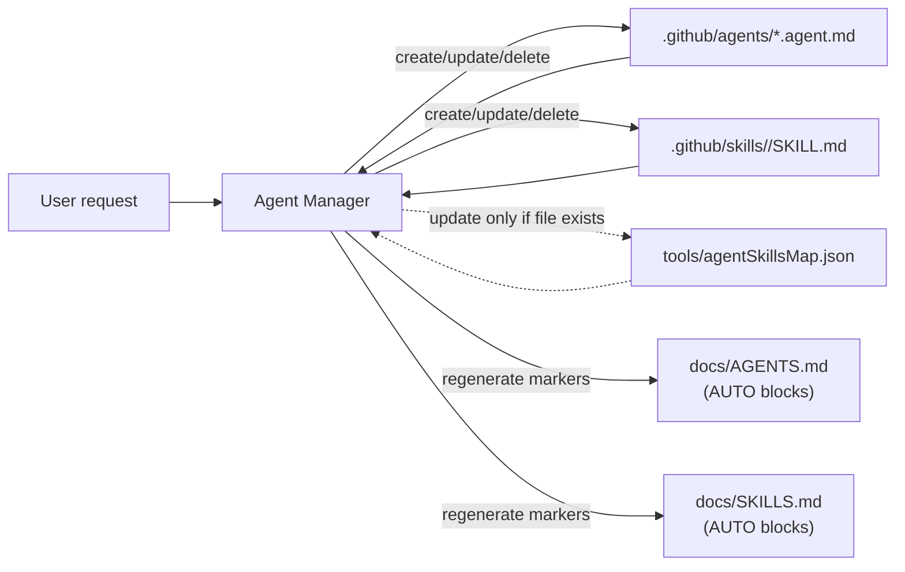

# Agent Manager

## Summary

**Agent Manager** is a repository-maintenance agent for the **VS Code Project Agents + Agent Skills system** in this repo. Its job is to keep agent definitions, skill definitions, the tooling mapping, and the docs indexes consistent with each other.

In scope, it maintains these artifacts:

- `.github/agents/*.agent.md`
- `.github/skills/<skill>/SKILL.md`
- `tools/agentSkillsMap.json` (when it already exists)
- `knowledge-base/` (shared knowledge base documents)

In this exact repository, it also maintains the human-friendly docs indexes:

- `docs/AGENTS.md`
- `docs/SKILLS.md`

Model: **GPT-5.2**

## Audience

Use Agent Manager if you want to:

- Create/update/delete an agent file under `.github/agents/`
- Create/update/delete a skill under `.github/skills/`
- Keep `tools/agentSkillsMap.json` in sync with agents/skills
- Assign concrete knowledge-base documents to an agent (when explicitly instructed)
- Regenerate the auto-generated sections of `docs/AGENTS.md` and `docs/SKILLS.md`

## What this agent does

## Diagram (how it keeps things in sync)

### Maintains consistency (always)

Whenever it creates/updates/deletes agents or skills, Agent Manager also:

- Updates `tools/agentSkillsMap.json` **if (and only if) the file already exists**

The mapping tracks optional knowledge base assignments per agent:

- Field name: `knowledge-base`
- Value: list of workspace-relative paths under `knowledge-base/`
- Default: present and empty (`[]`) unless the user assigns documents

Doc indexes are **repo-specific**:

- It updates `docs/AGENTS.md` and `docs/SKILLS.md` only when operating in this exact repository.
- If Agent Manager is copied into another repo, it must skip doc-index updates.

In this repo, it regenerates the auto-generated blocks in:

- `docs/AGENTS.md` between `<!-- AGENTS:BEGIN -->` and `<!-- AGENTS:END -->`
- `docs/SKILLS.md` between `<!-- SKILLS:BEGIN -->` and `<!-- SKILLS:END -->`

### Supports these operations

#### Create agent

When you ask to create a new agent, it will:

1. Create `.github/agents/<name>.agent.md` with front matter:
   - `name`, `description`, `model: GPT-5.2`
2. Ensure requested skills exist under `.github/skills/<skill>/SKILL.md`
3. If `tools/agentSkillsMap.json` exists, add/update the mapping entry
   - Unless you explicitly ask not to, it includes the skill `identify-self` by default for newly created agents
  - It also keeps an explicit `knowledge-base: []` field unless you assign documents
4. Keep the agent definition strict by default (minimum capabilities for the job)
5. Regenerate `docs/AGENTS.md` and `docs/SKILLS.md` auto-generated blocks

#### Update agent

When you ask to update an agent, it will:

- Edit the relevant `.github/agents/<agent>.agent.md`
- Update `tools/agentSkillsMap.json` if the agent’s skills change
- Keep an explicit empty `knowledge-base` field unless you assign knowledge-base documents
- Regenerate docs auto-generated blocks

#### Delete agent

When you ask to delete an agent, it follows a safe process:

1. If mapping exists, read the agent’s mapped skills list
2. Count how many agents use each of those skills
3. Delete `.github/agents/<agent>.agent.md`
4. Remove the agent entry from `tools/agentSkillsMap.json`
5. Delete any skill folders used **only** by that agent (usage count = 1)
6. Regenerate docs auto-generated blocks

#### Create skill

When you ask to create a skill, it will:

- Create `.github/skills/<skill>/SKILL.md` with front matter:
  - `name`, `description`
- Write clear usage instructions in the body
- Optionally link the skill in `tools/agentSkillsMap.json` (when requested and when mapping exists)
- Regenerate docs auto-generated blocks

#### Update skill (with compatibility rules)

Before changing an existing skill, Agent Manager **must**:

- If `tools/agentSkillsMap.json` exists, count how many agents use the skill
- State that usage count before applying changes

Then it applies compatibility rules:

- **0 agents** use it: free to update
- **1 agent** uses it: may update (keep aligned to that agent)
- **2+ agents** use it: must not change behavior in a way that changes other agents
  - If behavior would change, it creates a new skill (e.g. `<skill>-v2`) and updates only the intended agent mapping

Finally, it updates the mapping as needed and regenerates docs.

#### Delete skill

When you ask to delete a skill, it will:

- Delete `.github/skills/<skill>/`
- Unlink it from all agents in `tools/agentSkillsMap.json` (if present)
- Regenerate docs auto-generated blocks

## What this agent does NOT do

### Out of scope: product code

Agent Manager stays **strictly within the “agent system” scope**:

- Agents, skills, mapping, and docs indexes only

It will not implement, refactor, or modify application/product code unless you explicitly ask.

### No scripts/CLI helpers

It does not rely on scripts or CLI helpers to regenerate docs. It performs updates directly in repo files.

### Portability rule (important)

If this agent is copied into another repository, it must not introduce new tooling files:

- It **must not create** `tools/agentSkillsMap.json` in repos where it doesn’t already exist
- It only maintains the mapping **if it already exists**

### Safety restrictions around deletion

- It does not delete anything unless you explicitly request deletion.
- If deleting a skill would affect multiple agents, it must list impacted agents and ask for confirmation.

## How doc regeneration works (no scripts)

## Repo identity check (when to touch docs)

Agent Manager treats it as “this exact repository” only if all of these paths exist:

- `docs/AGENTS.md`
- `docs/SKILLS.md`
- `docs/COPILOT_BASICS_EN.md`
- `docs/COPILOT_BASICS_CZ.md`
- `tools/agentSkillsMap.json`

If this identity check fails, Agent Manager can still maintain `.github/agents/`, `.github/skills/`, and (if present) `tools/agentSkillsMap.json`, but it must **not** update `docs/AGENTS.md` or `docs/SKILLS.md`.

Agent Manager updates docs deterministically by replacing **only** the content between markers.

### `docs/AGENTS.md`

- Marker range: `<!-- AGENTS:BEGIN --> ... <!-- AGENTS:END -->`
- Lists agents from `.github/agents/*.agent.md`
- Uses agent front matter `name` and `description` when present
- If (and only if) `tools/agentSkillsMap.json` exists and lists skills for an agent, includes a `Skills: ...` line
- If (and only if) `tools/agentSkillsMap.json` exists and has a `knowledge-base` field for an agent, includes a `Knowledge base: ...` line

### `docs/SKILLS.md`

- Marker range: `<!-- SKILLS:BEGIN --> ... <!-- SKILLS:END -->`
- Lists skills from `.github/skills/<skill>/SKILL.md`
- Uses skill front matter `name` and `description` when present
- Always includes source links

Do not hand-edit inside these auto-generated blocks; ask Agent Manager to regenerate them.

## How to use Agent Manager (example prompts)

### Create an agent

- “Create a new agent called `release-notes-writer` with skills `identify-self` and `changelog-author`.”
- “Create an agent `timekeeper` but forbid writing files or running terminal commands.”

### Update an agent

- “Update `spec-writer` description to mention it produces ADRs.”
- “Add skill `identify-self` to `agent-manager` and regenerate docs.”

### Delete an agent

- “Delete the agent `old-agent` and remove any skills only it uses.”

### Create a skill

- “Create a new skill `api-docs` describing how to document REST endpoints.”

### Update a skill safely

- “Update the `identify-self` skill to include model name format, but don’t change behavior for other agents. If needed, create `identify-self-v2` and link only `agent-manager` to it.”

### Regenerate docs only

- “Regenerate the auto-generated sections of `docs/AGENTS.md` and `docs/SKILLS.md`.”

## Integrated skill: `identify-self`

When asked “who are you / what can you do / describe yourself”, Agent Manager follows the repo skill definition in:

- `.github/skills/identify-self/SKILL.md`

## Assumptions

- `docs/AGENTS.md` and `docs/SKILLS.md` contain the marker comments described above.
- Agents and skills use YAML front matter as specified.

## Verification

After any Agent Manager change, verify:

- The targeted agent/skill file exists and has valid front matter
- `tools/agentSkillsMap.json` is updated **only if it already existed**
- `docs/AGENTS.md` and `docs/SKILLS.md` marker blocks are regenerated and consistent
- No manual edits were made inside the marker blocks
